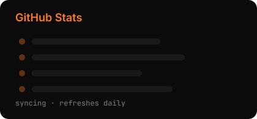
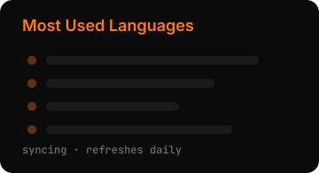

<p align="center">
  
</p>

<p align="center">
  
  
  
</p>

<br />

I build products end to end — web, mobile, desktop, and the infrastructure underneath — usually as the only engineer in the room. Right now that means **Behindit**: a social platform for showing the real process behind the work, not just the polished result.

```ts
const zaid = {
  location: "Amman, Jordan 🇯🇴",
  building: "Behindit",
  company: "Learnify Technologies, Inc.",
  dayJob: "Software Engineer @ Whispers Global",
  studying: "Computer Information Systems @ University of Jordan",
  stack: ["Next.js", "TypeScript", "Expo", "Tauri", "Convex", "LiveKit"],
  engineering: "solo, end to end",
} as const;
```

## 🛠️ What I've built

<table>
<tr>
<td width="50%" valign="top">

### Behindit
<sub><b>FOUNDER & CEO</b> · CURRENT FOCUS</sub>

A social platform for sharing the real process behind the work — not just the polished result. **2,000+ users**, grown organically.

`iOS` `Android` `Clerk`

</td>
<td width="50%" valign="top">

### Learnify
<sub><b>FOUNDER & CEO</b> · LIVESTREAMING</sub>

Livestreaming and community platform for the Arab world — builders and creators go live while doing the work. Shipped on web, desktop and mobile. 🏆 Won the **Queen Rania National Entrepreneurship Competition**; the beta launch drew **200+ people** (we expected 50).

`Next.js` `Tauri` `Expo` `LiveKit` `Convex` `Ably` `Stripe` `Fly.io` `AWS RDS`

</td>
</tr>
<tr>
<td width="50%" valign="top">

### Brandex Studio
<sub><b>WHISPERS GLOBAL</b> · AI CREATIVE PLATFORM</sub>

AI creative suite — FLUX and Gemini generation, Magnific upscaling, background removal and batch pipelines. Also built the Gemini batch-rewriting pipeline behind [Brandex](https://brandexme.com)'s **80,000+ product** catalog.

`Gemini` `FLUX` `Magnific` `Bunny CDN` `GA4 / GTM`

</td>
<td width="50%" valign="top">

### MetaFit
<sub><b>B2B SAAS</b> · FITNESS</sub>

Software for gyms that turns InBody body-composition scans into personalized training and nutrition plans for every member.

`Next.js` `Convex` `Clerk` `OpenAI`

</td>
</tr>
</table>

<sub>Also shipped: <b>JoVenture</b> — a tourism experience marketplace for Jordan · the <b>SVF</b> site for the University of Jordan's deep-tech R&D platform · the <b>Diwan Electric</b> website.</sub>

## 🧰 Stack

<p align="center">
  <a href="https://skillicons.dev"></a>
  <br />
  <a href="https://skillicons.dev"></a>
</p>

<p align="center">
  
  
  
  
  
  
  
  
</p>

## 🏆 Recognition

- 🏆 **Winner** — Queen Rania National Entrepreneurship Competition <sub>(Learnify)</sub>
- 🥇 **1st place** — AI Week Jordan
- 🌍 **Top 20** — Google AI Genesis World Finals, Dubai
- 🎤 **Competed** — CABSAT, Dubai
- 🤝 **Backed by** — NVIDIA Inception · AWS Activate · Google for Startups

## 📊 On GitHub

<p align="center">
  
  
</p>

<p align="center">
  <picture>
    <source media="(prefers-color-scheme: dark)" srcset="https://raw.githubusercontent.com/Dweirii/Dweirii/HEAD/profile/snake-dark.svg" />
    <source media="(prefers-color-scheme: light)" srcset="https://raw.githubusercontent.com/Dweirii/Dweirii/HEAD/profile/snake-light.svg" />
    
  </picture>
</p>

<!--
  Connect — fill in your handles, then delete these comment markers to show the row.

<p align="center">
  <a href="https://www.linkedin.com/in/YOUR-HANDLE"></a>&nbsp;
  <a href="https://x.com/YOUR-HANDLE"></a>&nbsp;
  <a href="mailto:YOU@EXAMPLE.COM"></a>
</p>
-->

<p align="center"><sub>Built from Amman, for the Arab world. <b>Behind every product is a process.</b></sub></p>
